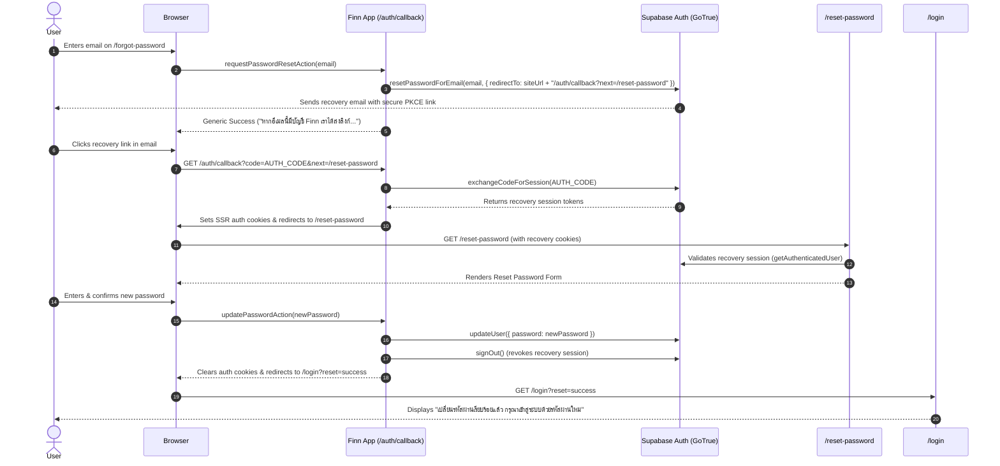

# FINN — Password Recovery & Production Auth Cleanup Implementation Report

## 1. Executive Summary

This report documents the implementation of the production-ready Forgot Password / Reset Password recovery flow for **Finn**, the complete removal of the public Demo User authentication mechanism, and the audit/enforcement of fail-closed production authentication.

All changes strictly preserve **Finn Theme V3**, responsive mobile behavior (including full iPhone 11 Pro Max verification), dark/light theme switching, and zero-leakage security standards.

---

## 2. Files Added & Modified

### Files Added
1. **[`src/lib/server/url.ts`](file:///C:/Users/Jeffy/OneDrive/Desktop/agy/finn/src/lib/server/url.ts)**:
   - Canonical site URL resolver (`getCanonicalSiteUrl`): Resolves `NEXT_PUBLIC_SITE_URL`, falling back strictly to `https://finn-finance-three.vercel.app` (production) or `http://localhost:3000` (development/test). Never trusts incoming `Host` or `X-Forwarded-Host` headers.
   - Open-redirect sanitizer (`sanitizeRedirectPath`): Strictly permits only internal relative paths starting with `/`. Blocks absolute URLs (`https://...`), protocol-relative URLs (`//...`), pseudo-protocols (`javascript:...`, `data:...`), and backslash bypasses (`/\...`, `\\...`).
2. **[`src/app/auth/callback/route.ts`](file:///C:/Users/Jeffy/OneDrive/Desktop/agy/finn/src/app/auth/callback/route.ts)**:
   - SSR/PKCE recovery callback route handler. Exchanges the incoming authorization `code` for an authenticated session using `@supabase/ssr` cookies. Sanitizes any `next` parameter and redirects safely to `/reset-password`. Handles missing or expired codes by redirecting to `/forgot-password?error=invalid_or_expired`.
3. **[`src/app/(auth)/forgot-password/page.tsx`](file:///C:/Users/Jeffy/OneDrive/Desktop/agy/finn/src/app/(auth)/forgot-password/page.tsx)**:
   - Production Forgot Password request page. Features Finn brand identity, anti-account-enumeration guarantees, accessible form elements, loading states, and query parameter error alerts (`invalid_or_expired`).
4. **[`src/app/(auth)/reset-password/page.tsx`](file:///C:/Users/Jeffy/OneDrive/Desktop/agy/finn/src/app/(auth)/reset-password/page.tsx)**:
   - Server Component gate. Verifies that an active recovery/authenticated session exists. If unauthenticated, it suppresses the password reset form and displays "ลิงก์รีเซ็ตรหัสผ่านไม่ถูกต้องหรือหมดอายุแล้ว" with a "ขอลิงก์ใหม่" CTA.
5. **[`src/app/(auth)/reset-password/ResetPasswordClient.tsx`](file:///C:/Users/Jeffy/OneDrive/Desktop/agy/finn/src/app/(auth)/reset-password/ResetPasswordClient.tsx)**:
   - Client form for resetting the password with new password and confirmation inputs, show/hide password toggles, client-side equality/length validation, and loading indicators.
6. **[`tests/auth/auth-recovery.test.ts`](file:///C:/Users/Jeffy/OneDrive/Desktop/agy/finn/tests/auth/auth-recovery.test.ts)**:
   - Unit and integration tests (22 test cases) covering canonical URLs, open-redirect sanitization, anti-enumeration, production fail-closed enforcement, and password policies.
7. **[`e2e/auth-recovery.spec.ts`](file:///C:/Users/Jeffy/OneDrive/Desktop/agy/finn/e2e/auth-recovery.spec.ts)**:
   - Playwright end-to-end tests (24 test runs across Desktop Chrome and iPhone 11 Pro Max) covering the complete recovery lifecycle and demo removal.

### Files Modified
1. **[`src/app/actions/auth.ts`](file:///C:/Users/Jeffy/OneDrive/Desktop/agy/finn/src/app/actions/auth.ts)**:
   - Removed `signInDemoAction`.
   - Enforced fail-closed behavior in `signInAction` and `signUpAction`: in production, Supabase errors or network failures NEVER create a `finn_session` cookie or impersonate `dev-user-12345`.
   - Added `requestPasswordResetAction`: initiates password recovery via `supabase.auth.resetPasswordForEmail()`. Returns indistinguishable success for both known and unknown emails.
   - Added `updatePasswordAction`: updates the user password via `supabase.auth.updateUser()`, validates minimum length and equality, terminates the temporary recovery session, and redirects to `/login?reset=success`.
2. **[`src/app/(auth)/login/page.tsx`](file:///C:/Users/Jeffy/OneDrive/Desktop/agy/finn/src/app/(auth)/login/page.tsx)**:
   - Completely eliminated Demo User button ("ทดลองใช้งาน (Explore as Demo User)"), demo disclaimer ("โหมดทดลอง — ข้อมูลนี้เป็นตัวอย่างสำหรับการประเมินผล"), demo divider, sparkles icon, and `signInDemoAction` import.
   - Added secondary "ลืมรหัสผ่าน?" link aligned beside the password field header leading to `/forgot-password`.
   - Added support for `/login?reset=success` with an emerald status banner: "เปลี่ยนรหัสผ่านเรียบร้อยแล้ว กรุณาเข้าสู่ระบบด้วยรหัสผ่านใหม่".
3. **[`src/lib/server/session.ts`](file:///C:/Users/Jeffy/OneDrive/Desktop/agy/finn/src/lib/server/session.ts)**:
   - Updated `isDemoModeAllowed()`: strictly returns `false` in production runtime.
   - Added `isTestAuthFallbackAllowed()`: strictly returns `false` in production runtime (`NODE_ENV === "production"` without `PLAYWRIGHT_TEST === "1"`).
4. **[`src/lib/server/auth.ts`](file:///C:/Users/Jeffy/OneDrive/Desktop/agy/finn/src/lib/server/auth.ts)**:
   - Wrapped `cookies()` in safe try/catch for deterministic test and request lifecycle compatibility.

---

## 3. Architecture & Recovery Flow



---

## 4. Production Fail-Closed Security

### Problem Audited
Prior to this implementation, `src/app/actions/auth.ts` contained dev/offline fallback logic:
```typescript
// Former Vulnerability:
if (error.message.includes("fetch failed") || error.message.includes("Invalid API key") || error.message.includes("dummy")) {
  cookieStore.set("finn_session", await signSessionPayload({ id: "dev-user-12345", ... }));
}
```
If Supabase encountered an outage, misconfigured key, or network failure in production, this logic could silently create a signed `finn_session` and grant access as an impersonated user.

### Fail-Closed Enforcement
The logic was rewritten to enforce a strict invariant:
```typescript
/**
 * Test-only authentication fallback guard.
 * Strictly NEVER allowed in production unless explicit test runner flag (PLAYWRIGHT_TEST) is present.
 */
export function isTestAuthFallbackAllowed(): boolean {
  if (process.env.NODE_ENV === "production" && process.env.PLAYWRIGHT_TEST !== "1") {
    return false;
  }
  return (
    process.env.PLAYWRIGHT_TEST === "1" ||
    process.env.VITEST === "true" ||
    process.env.NODE_ENV === "test" ||
    process.env.NODE_ENV === "development"
  );
}
```
In production:
- Supabase failure returns: `{ success: false, error: "ระบบยืนยันตัวตนขัดข้องชั่วคราว กรุณาลองใหม่อีกครั้งในภายหลัง" }`.
- Zero cookies (`finn_session`) are created.
- Zero user impersonation occurs.
- The request terminates closed.

---

## 5. Public Demo Removal & Test Accommodation

### Public Changes
1. Removed `signInDemoAction` from server actions.
2. Removed all demo UI controls, banners, and disclaimer text from `src/app/(auth)/login/page.tsx`.
3. Verified no query parameter or route (`/login?error=demo_disabled`, `?demo=true`, etc.) can instantiate a demo session in production.

### Internal Test Accommodation
- Automated test suites (Playwright and Vitest) require deterministic offline execution with mock datastores.
- The `isTestAuthFallbackAllowed()` and `isDemoModeAllowed()` helpers check `process.env.PLAYWRIGHT_TEST === "1"` or `process.env.VITEST === "true"`.
- If `process.env.NODE_ENV === "production"` and `PLAYWRIGHT_TEST !== "1"`, both helpers return `false` unconditionally.
- Standard email/password submission on `/login` with `demo@finn.local` and `password123` continues to support automated test fixtures without exposing any public demo button or production endpoint.

---

## 6. Security Invariants & Policy

| Requirement | Implementation Details |
|---|---|
| **Account Anti-Enumeration** | `requestPasswordResetAction` returns identical success response `{ success: true }` regardless of whether the email exists in Supabase. Form displays: *"หากอีเมลนี้มีบัญชี Finn เราได้ส่งลิงก์สำหรับตั้งรหัสผ่านใหม่แล้ว"*. |
| **Open-Redirect Protection** | `sanitizeRedirectPath` in `src/lib/server/url.ts` rejects absolute protocols, `//` protocol-relative schemes, `javascript:`, and backslash bypasses. Defaults safely to `/reset-password`. |
| **Recovery Session Gate** | `/reset-password` runs server-side verification using `getAuthenticatedUser()`. If unauthenticated or expired, it renders an alert and link to request a new link, withholding the reset form from the DOM. |
| **Recovery Session Revocation** | Upon successful `updateUser()`, the server executes `supabase.auth.signOut()` and clears `finn_session` cookies, redirecting to `/login?reset=success` so no stale recovery token lingers. |
| **Host Header Injection Defense** | Canonical site URL resolution uses `NEXT_PUBLIC_SITE_URL` and preconfigured domains; it never trusts the HTTP `Host` or `X-Forwarded-Host` headers. |
| **Secret Protection** | No service role key is used or exposed. Passwords are never logged or stored in the Finn application database; they are managed exclusively by Supabase Auth GoTrue. |

---

## 7. Verification & Test Results

### 1. TypeScript & Lint
- `npm run typecheck`: **PASSED** (0 errors)
- `npm run lint`: **PASSED** (0 errors, 0 warnings)

### 2. Unit & Integration Tests (`vitest run`)
- **Total Test Suites**: 9 passed (9)
- **Total Tests**: 105 passed (105)
  - `tests/auth/auth-recovery.test.ts`: 22 passed
  - `tests/finance/calendar.test.ts`: 9 passed
  - `tests/finance/finance.test.ts`: 7 passed
  - `tests/supabase/supabase-data-layer.test.ts`: 8 passed
  - `tests/slip/slip-domain.test.ts`: 25 passed
  - `tests/security/slip-security.test.ts`: 9 passed
  - `tests/security/adversarial.test.ts`: 14 passed
  - `tests/theme/theme.test.ts`: 7 passed
  - `tests/server/data-store.test.ts`: 4 passed

### 3. Production Build (`next build`)
- Compiled successfully: **PASSED**
- All 9 static and dynamic routes optimized, including `/auth/callback`, `/forgot-password`, `/reset-password`, `/login`.

### 4. Playwright End-to-End Suite (`playwright test`)
- **Total Test Runs**: 74 passed (74)
- **Projects**: Desktop Chrome & iPhone 11 Pro Max (414x896 viewport)
- Specific scenarios verified:
  1. Login page contains subtle "ลืมรหัสผ่าน?" link.
  2. Login page does NOT contain Demo User controls or demo disclaimer.
  3. Forgot password page renders all UI elements (Finn logo, heading, instruction, email, submit button, back link).
  4. Forgot password page layout is responsive with touch targets >= 40px and zero horizontal overflow on iPhone 11 Pro Max.
  5. Known and unknown email receive indistinguishable UI responses.
  6. Invalid email validation displays error without sending.
  7. Invalid/expired callback code redirects to `/forgot-password?error=invalid_or_expired` and displays alert banner.
  8. Auth callback enforces Open Redirect protection (rejects external domains and protocol-relative URLs).
  9. Reset password page requires valid recovery session and blocks unauthenticated access.
  10. Reset password rejects password confirmation mismatch.
  11. Successful password update redirects to `/login?reset=success` with banner: *"เปลี่ยนรหัสผ่านเรียบร้อยแล้ว กรุณาเข้าสู่ระบบด้วยรหัสผ่านใหม่"*.
  12. Standard email/password login and logout continue to work seamlessly without Demo button.

---

## 8. Required Supabase Dashboard Configuration

To complete production configuration in the Supabase Project Dashboard:

1. **Authentication → URL Configuration**:
   - **Site URL**:
     `https://finn-finance-three.vercel.app`
   - **Redirect URLs (Allowed Callback URLs)**:
     - `https://finn-finance-three.vercel.app/auth/callback`
     - `https://finn-finance-three.vercel.app/auth/callback?next=/reset-password`
     - `http://localhost:3000/auth/callback` (for local development)
     - `http://localhost:3000/auth/callback?next=/reset-password`
2. **Authentication → Email Templates → Reset Password**:
   - Verify the email body contains:
     ```html
     <h2>Reset Password</h2>
     <p>Follow this link to reset the password for your Finn account:</p>
     <p><a href="{{ .ConfirmationURL }}">Reset Password</a></p>
     ```
   - Ensure the template redirect URL references the `/auth/callback` endpoint.
3. **Environment Variables on Vercel**:
   - `NEXT_PUBLIC_SITE_URL` = `https://finn-finance-three.vercel.app`
   - `NEXT_PUBLIC_SUPABASE_URL` = `https://<your-project-id>.supabase.co`
   - `NEXT_PUBLIC_SUPABASE_ANON_KEY` = `<your-supabase-anon-key>`
