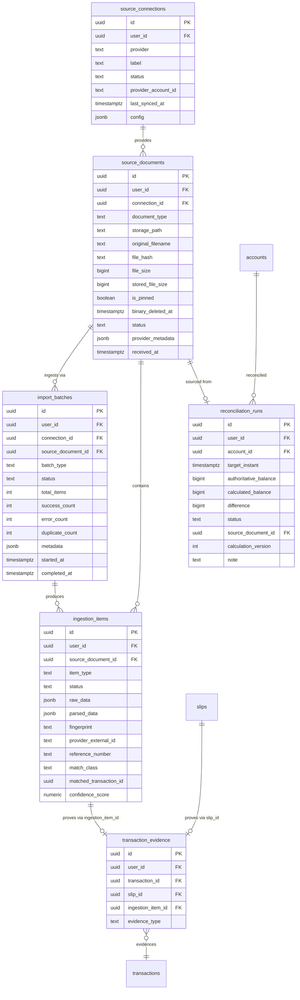
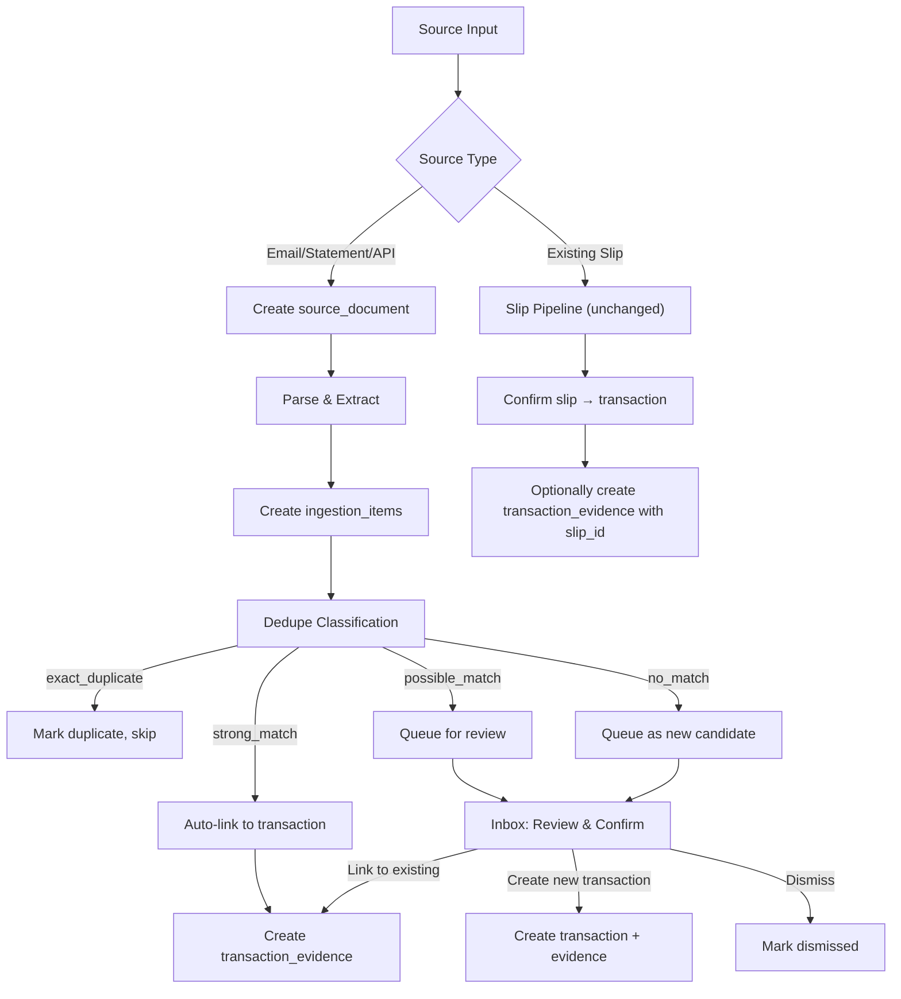

# Multi-Source Inbox Architecture

> Status: **Approved with Required Amendments — Decisions Finalized**
> Version: 1.0
> Date: 2026-09-16
> Applies to: Finn Phase 3

---

## 1. Overview

Phase 3 extends Finn from a slip-only transaction source to a **multi-source evidence system** that can ingest transaction candidates from:

- **Existing slip pipeline** (photos of bank transfer receipts, unchanged)
- **Gmail forwards** (bank notification emails)
- **Bank statement uploads** (CSV / PDF)
- **Future providers** (Open Banking APIs, PromptPay, etc.)

The architecture introduces a **Source → Ingestion → Evidence → Transaction** pipeline while preserving the existing slip confirmation flow exactly as-is.

---

## 2. Mandatory Architectural Decisions

#### Decision 1: Existing Slip → Transaction Evidence Bridge

> **Principle:** The existing slip pipeline MUST remain canonical and unchanged. Do NOT require migrating existing slips into source_documents just to participate in the new evidence model.

`transaction_evidence` bridges both legacy slips and new multi-source ingestion items to transactions:

```
transaction_evidence:
  id                UUID PK
  user_id           UUID NOT NULL  → auth.users(id)
  transaction_id    UUID NOT NULL  → transactions(id)
  slip_id           UUID NULLABLE  → slips(id)
  ingestion_item_id UUID NULLABLE  → ingestion_items(id)
  evidence_type     TEXT NOT NULL
  created_at        TIMESTAMPTZ NOT NULL DEFAULT now()
```

**Constraint:** EXACTLY ONE of `slip_id` or `ingestion_item_id` must be non-null.

**Evidence type values:**
- `slip` — existing Finn slip
- `email_notification` — Gmail bank notification
- `statement_row` — parsed row from a bank statement
- `api_import` — direct API import

**Linking paths:**

```
Existing slip         → transaction_evidence.slip_id
Gmail notification    → source_document → ingestion_item → transaction_evidence.ingestion_item_id
Statement CSV row     → source_document → ingestion_item → transaction_evidence.ingestion_item_id
```

**Example — Transaction #123 with 3 evidence rows:**

| Evidence # | slip_id           | ingestion_item_id  | evidence_type      |
|-----------|-------------------|--------------------|--------------------|
| 1         | existing-slip-uuid | NULL               | slip               |
| 2         | NULL              | gmail-item-uuid    | email_notification |
| 3         | NULL              | stmt-row-uuid      | statement_row      |

This achieves:
**1 Transaction, 3 Evidence rows** — without rewriting the existing slip confirmation architecture.

**Enforce at DB level:**
1. **CHECK constraint:** `((slip_id IS NOT NULL)::int + (ingestion_item_id IS NOT NULL)::int) = 1`
2. **UNIQUE on `(slip_id)` WHERE `slip_id IS NOT NULL`** — slip evidence can link to at most one transaction
3. **UNIQUE on `(ingestion_item_id)` WHERE `ingestion_item_id IS NOT NULL`** — ingestion_item can link to at most one transaction
4. **All linked records must belong to the same user** — enforced at DB level via `BEFORE INSERT OR UPDATE` trigger, not relying only on UI or RLS for cross-user ownership integrity.

---

### Decision 2: Deduplication — Separate Strong Match from Suggestion

> **Principle:** Financial safety is more important than aggressive deduplication. Never auto-merge on weak signals.

The architecture does NOT treat external ID, file hash, reference, account + amount + timestamp, and fingerprint as equivalent auto-merge signals.

**Explicit Result Classes:**

| Class             | Action           | Description                                                  |
|-------------------|------------------|--------------------------------------------------------------|
| `exact_duplicate` | Auto-skip/flag   | Identical source document (same file SHA-256 or identical message) |
| `strong_match`    | Auto-link/Auto-dedup | Same transaction proven by strong scoped identifier          |
| `possible_match`  | Queue for review | Likely match; requires human confirmation in Inbox           |
| `no_match`        | Create candidate | No matching transaction found; presented as new item         |

**AUTO-LINK / AUTO-DEDUP may use ONLY strong identifiers:**

| Strong Identifier             | Required Scope                                              |
|-------------------------------|-------------------------------------------------------------|
| **A. Provider external ID**   | `user_id` + `provider_connection_id` + `provider_external_id` |
| **B. Exact file SHA-256**     | Where document semantics support exact duplication           |
| **C. Transaction reference**  | ONLY when properly scoped: `institution` / `account` / `direction` / `reference` |

> Reference numbers are **NEVER assumed globally unique across all banks**. Scoping by institution, account, and direction is required before treating a reference as a strong match.

**Weak signals (MUST NOT auto-merge by themselves — produce `possible_match`):**

- account + amount + timestamp
- amount + merchant
- amount + date
- fuzzy description similarity
- candidate fingerprint without strong source evidence

> Even identical amount + exact second may theoretically be two legitimate separate transactions (e.g. repeated transfers). Financial safety is more important than aggressive deduplication. These must produce `possible_match` and require review/linking.

**Fingerprint design:**
- Composite hash of normalized fields (`amount`, `approximate_timestamp`, `masked_account`, `direction`)
- Used ONLY for `possible_match` candidate ranking and fast lookup, **NEVER for auto-linking**.

---

### Decision 3: Provider Tokens Separated from Connection Metadata

> **Principle:** `source_connections` is browser-visible connection metadata. Do NOT store OAuth refresh/access token ciphertext directly in a table that normal authenticated browser queries can select.

**Phase 3 Decision: OPTION A (Preferred for Phase 3)**
- Do not persist provider credentials yet.
- Only implement connection metadata / schema stubs until real Google OAuth work begins.

`source_connections` table stores browser-visible connection metadata only:

```
source_connections:
  id                  UUID PK
  user_id             UUID NOT NULL
  provider            TEXT NOT NULL           -- 'gmail', 'bank_statement', 'api', 'manual'
  label               TEXT                    -- user-facing connection name
  status              TEXT NOT NULL           -- 'active', 'paused', 'error', 'revoked'
  provider_account_id TEXT                    -- email address, account identifier
  last_synced_at      TIMESTAMPTZ
  config              JSONB                   -- non-secret provider settings
  created_at          TIMESTAMPTZ NOT NULL DEFAULT now()
  updated_at          TIMESTAMPTZ NOT NULL DEFAULT now()
```

**OPTION B Specification (Documented for Phase 4+ implementation):**
When real Google OAuth work begins, tokens must reside in a dedicated, server-only credentials table:

```sql
-- Phase 4+ dedicated server-only credential table:
CREATE TABLE IF NOT EXISTS public.source_connection_credentials (
    id                      UUID PRIMARY KEY DEFAULT gen_random_uuid(),
    connection_id           UUID NOT NULL REFERENCES public.source_connections(id) ON DELETE CASCADE,
    encrypted_refresh_token BYTEA NOT NULL,
    encrypted_access_token  BYTEA NULL,
    nonce                   BYTEA NOT NULL,
    auth_tag                BYTEA NOT NULL,
    key_version             INT NOT NULL DEFAULT 1,
    expires_at              TIMESTAMPTZ NULL,
    created_at              TIMESTAMPTZ NOT NULL DEFAULT now(),
    updated_at              TIMESTAMPTZ NOT NULL DEFAULT now()
);

-- NO normal authenticated SELECT permission. Server/service-role access ONLY.
REVOKE ALL ON public.source_connection_credentials FROM authenticated, anon;
```

> **Security Rule:** Never call something "encrypted token storage" unless encryption is actually implemented with a documented key boundary. Do not invent production encryption keys in Phase 3.

---

### Decision 4: Reconciliation Runs Are Audit Snapshots

> **Principle:** A `reconciliation_run` must preserve what Finn knew at that exact moment. Store audit snapshots, never silently recompute and overwrite old runs.

A reconciliation run records Finn's computation at a specific point in time:

```
reconciliation_runs:
  id                    UUID PK
  user_id               UUID NOT NULL
  account_id            UUID NOT NULL     → accounts(id)
  target_instant        TIMESTAMPTZ NOT NULL
  authoritative_balance BIGINT NOT NULL   -- authoritative balance (satang)
  calculated_balance    BIGINT NULLABLE   -- Finn's calculated balance at run time
  difference            BIGINT NULLABLE   -- authoritative - calculated
  status                TEXT NOT NULL     -- 'balanced' | 'difference_found' | 'cannot_calculate_safely'
  source_document_id    UUID NULLABLE     → source_documents(id)
  calculation_version   INT NOT NULL      -- version of balance calc algorithm
  note                  TEXT NULLABLE
  created_at            TIMESTAMPTZ NOT NULL DEFAULT now()
```

**Statuses:**

| Status                    | Meaning                                           |
|---------------------------|---------------------------------------------------|
| `balanced`                | `calculated_balance == authoritative_balance`       |
| `difference_found`        | `calculated_balance ≠ authoritative_balance`        |
| `cannot_calculate_safely` | target < balance_as_of or insufficient data       |

**Rules:**
1. **Audit Snapshot Immutability:** Old reconciliation runs are **never recomputed or overwritten** when transactions later change.
2. **New Run on Reconciliation:** A new reconciliation action creates a **NEW run record**.
3. **Algorithm Versioning:** Each run stores `calculation_version` to track evolution in calculation logic.

**`calculateAccountBalanceAt` Semantics:**

| Condition                    | Result                                                         |
|------------------------------|----------------------------------------------------------------|
| `target == balance_as_of`    | Exactly `opening_balance`                                      |
| `target > balance_as_of`     | `opening_balance` + transactions in `(balance_as_of, target]`  |
| `target < balance_as_of`     | `cannot_calculate_safely` (returns null, no fake reconstruction) |

> **No fake reconstruction.** Finn refuses to backward-extrapolate before the baseline `balance_as_of`.

---

## 3. Data Model

### 3.1 Entity Relationship



### 3.2 Table Specifications

#### `source_connections`

| Column              | Type         | Constraints                                           |
|---------------------|-------------|-------------------------------------------------------|
| id                  | UUID        | PK, default gen_random_uuid()                         |
| user_id             | UUID        | NOT NULL, FK → auth.users(id) ON DELETE CASCADE       |
| provider            | TEXT        | NOT NULL, CHECK (gmail, bank_statement, api, manual)  |
| label               | TEXT        | User-facing connection name                           |
| status              | TEXT        | NOT NULL, CHECK (active, paused, error, revoked)      |
| provider_account_id | TEXT        | Email address or account identifier                   |
| last_synced_at      | TIMESTAMPTZ |                                                       |
| config              | JSONB       | Non-secret provider settings                          |
| created_at          | TIMESTAMPTZ | NOT NULL DEFAULT now()                                |
| updated_at          | TIMESTAMPTZ | NOT NULL DEFAULT now()                                |

- Index: `(user_id)`
- Unique: `(user_id, provider, provider_account_id)`
- RLS: user_id = auth.uid()

#### `source_documents`

| Column              | Type         | Constraints                                             |
|---------------------|--------------|---------------------------------------------------------|
| id                  | UUID         | PK, default gen_random_uuid()                           |
| user_id             | UUID         | NOT NULL, FK → auth.users(id) ON DELETE CASCADE         |
| connection_id       | UUID         | FK → source_connections(id), nullable for manual uploads |
| document_type       | TEXT         | NOT NULL, CHECK (email, csv_statement, pdf_statement, api_response) |
| storage_path        | TEXT         |                                                         |
| original_filename   | TEXT         |                                                         |
| file_hash           | TEXT         | SHA-256 of original file                                |
| file_size           | BIGINT       | Original file size in bytes                             |
| stored_file_size    | BIGINT       | Stored/compressed file size in bytes                    |
| is_pinned           | BOOLEAN      | NOT NULL DEFAULT false (pinned never cleanup candidate) |
| binary_deleted_at   | TIMESTAMPTZ  | NULL if binary exists, set when binary pruned           |
| status              | TEXT         | NOT NULL DEFAULT 'received', CHECK (received, processing, processed, failed) |
| provider_metadata   | JSONB        | Provider-specific envelope (email headers, etc.)        |
| received_at         | TIMESTAMPTZ  | NOT NULL DEFAULT now()                                  |
| created_at          | TIMESTAMPTZ  | NOT NULL DEFAULT now()                                  |
| updated_at          | TIMESTAMPTZ  | NOT NULL DEFAULT now()                                  |

- Index: `(user_id)`, `(connection_id)`, `(file_hash)`, `(user_id, is_pinned)`
- RLS: user_id = auth.uid()

#### `import_batches`

| Column              | Type         | Constraints                                            |
|---------------------|-------------|-------------------------------------------------------|
| id                  | UUID         | PK, default gen_random_uuid()                          |
| user_id             | UUID         | NOT NULL, FK → auth.users(id) ON DELETE CASCADE        |
| connection_id       | UUID         | FK → source_connections(id), nullable                  |
| source_document_id  | UUID         | FK → source_documents(id), nullable                    |
| batch_type          | TEXT         | NOT NULL, CHECK (csv_statement, gmail_sync, drive_sync, manual_import) |
| status              | TEXT         | NOT NULL DEFAULT 'pending', CHECK (pending, processing, completed, failed) |
| total_items         | INT          | NOT NULL DEFAULT 0                                     |
| success_count       | INT          | NOT NULL DEFAULT 0                                     |
| error_count         | INT          | NOT NULL DEFAULT 0                                     |
| duplicate_count     | INT          | NOT NULL DEFAULT 0                                     |
| metadata            | JSONB        | NOT NULL DEFAULT '{}'                                  |
| started_at          | TIMESTAMPTZ  | NOT NULL DEFAULT now()                                 |
| completed_at        | TIMESTAMPTZ  |                                                        |
| created_at          | TIMESTAMPTZ  | NOT NULL DEFAULT now()                                 |
| updated_at          | TIMESTAMPTZ  | NOT NULL DEFAULT now()                                 |

- Index: `(user_id)`, `(user_id, status)`
- RLS: user_id = auth.uid()

#### `ingestion_items`

| Column                 | Type         | Constraints                                            |
|-----------------------|-------------|-------------------------------------------------------|
| id                     | UUID         | PK, default gen_random_uuid()                          |
| user_id                | UUID         | NOT NULL, FK → auth.users(id) ON DELETE CASCADE        |
| source_document_id     | UUID         | NOT NULL, FK → source_documents(id)                    |
| connection_id          | UUID         | FK → source_connections(id), nullable                  |
| item_type              | TEXT         | NOT NULL, CHECK (email_notification, statement_row, api_transaction) |
| status                 | TEXT         | NOT NULL DEFAULT 'pending', CHECK (pending, matched, linked, dismissed, error) |
| raw_data               | JSONB        | Original unparsed data                                 |
| parsed_data            | JSONB        | Normalized parsed fields                               |
| fingerprint            | TEXT         | Composite hash for possible_match scoring              |
| provider_external_id   | TEXT         | Provider's unique transaction ID                       |
| reference_number       | TEXT         | Bank reference / transaction reference                 |
| match_class            | TEXT         | CHECK (exact_duplicate, strong_match, possible_match, no_match) |
| matched_transaction_id | UUID         | FK → transactions(id), set on link                     |
| confidence_score       | NUMERIC(3,2)|                                                        |
| created_at             | TIMESTAMPTZ  | NOT NULL DEFAULT now()                                 |
| updated_at             | TIMESTAMPTZ  | NOT NULL DEFAULT now()                                 |

- Index: `(user_id)`, `(source_document_id)`, `(connection_id)`, `(provider_external_id)`, `(fingerprint)`, `(status)`
- Unique: `(user_id, connection_id, provider_external_id)` WHERE connection_id IS NOT NULL AND provider_external_id IS NOT NULL — scoped uniqueness by user + provider connection + external ID
- RLS: user_id = auth.uid()

#### `transaction_evidence`

| Column            | Type         | Constraints                                            |
|-------------------|-------------|-------------------------------------------------------|
| id                | UUID         | PK, default gen_random_uuid()                          |
| user_id           | UUID         | NOT NULL, FK → auth.users(id) ON DELETE CASCADE        |
| transaction_id    | UUID         | NOT NULL, FK → transactions(id)                        |
| slip_id           | UUID         | FK → slips(id), nullable                               |
| ingestion_item_id | UUID         | FK → ingestion_items(id), nullable                     |
| evidence_type     | TEXT         | NOT NULL, CHECK (slip, email_notification, statement_row, api_import) |
| created_at        | TIMESTAMPTZ  | NOT NULL DEFAULT now()                                 |

- CHECK: `(slip_id IS NOT NULL) != (ingestion_item_id IS NOT NULL)` — exactly one must be set
- UNIQUE on `(slip_id)` WHERE slip_id IS NOT NULL
- UNIQUE on `(ingestion_item_id)` WHERE ingestion_item_id IS NOT NULL
- Index: `(transaction_id)`, `(user_id)`
- RLS: user_id = auth.uid()
- **Cross-user trigger:** validates that transaction, slip/ingestion_item all share the same user_id

#### `reconciliation_runs`

| Column                | Type         | Constraints                                           |
|----------------------|-------------|-------------------------------------------------------|
| id                    | UUID         | PK, default gen_random_uuid()                          |
| user_id               | UUID         | NOT NULL, FK → auth.users(id) ON DELETE CASCADE        |
| account_id            | UUID         | NOT NULL, FK → accounts(id)                            |
| target_instant        | TIMESTAMPTZ  | NOT NULL                                               |
| authoritative_balance | BIGINT       | NOT NULL                                               |
| calculated_balance    | BIGINT       | nullable                                               |
| difference            | BIGINT       | nullable                                               |
| status                | TEXT         | NOT NULL, CHECK (balanced, difference_found, cannot_calculate_safely) |
| source_document_id    | UUID         | FK → source_documents(id), nullable                    |
| calculation_version   | INT          | NOT NULL DEFAULT 1                                     |
| note                  | TEXT         |                                                        |
| created_at            | TIMESTAMPTZ  | NOT NULL DEFAULT now()                                 |

- Index: `(user_id, account_id)`, `(account_id, target_instant)`
- RLS: user_id = auth.uid()
- **Immutable:** no UPDATE policy — reconciliation runs are append-only

---

## 4. Ingestion Pipeline

### 4.1 Flow



### 4.2 Deduplication Algorithm

```
function classifyMatch(item: IngestionItem, existingTransactions: Transaction[]): MatchResult {

  // 1. Check exact file duplicate (source_document level)
  if (item.sourceDocument.fileHash && existsWithSameHash(item.sourceDocument.fileHash)) {
    return { class: 'exact_duplicate', confidence: 1.0 }
  }

  // 2. Check strong identifiers
  if (item.providerExternalId) {
    const match = findByProviderExternalId(item.userId, item.connectionId, item.providerExternalId)
    if (match) return { class: 'strong_match', transaction: match, confidence: 1.0 }
  }

  if (item.referenceNumber) {
    // Scoped: same institution + account + direction + reference
    const match = findByScopedReference(item)
    if (match) return { class: 'strong_match', transaction: match, confidence: 0.95 }
  }

  // 3. Check weak signals — NEVER auto-merge
  const candidates = findPossibleMatches(item)  // amount + date window, etc.
  if (candidates.length > 0) {
    return { class: 'possible_match', candidates, confidence: bestScore(candidates) }
  }

  return { class: 'no_match', confidence: 0 }
}
```

---

## 5. TypeScript Types

### 5.1 New Domain Types

```typescript
// Source connection (browser-visible metadata only)
type SourceProvider = 'gmail' | 'bank_statement' | 'api' | 'manual'
type ConnectionStatus = 'active' | 'paused' | 'error' | 'revoked'

interface SourceConnection {
  id: string
  userId: string
  provider: SourceProvider
  label: string | null
  status: ConnectionStatus
  providerAccountId: string | null
  lastSyncedAt: string | null
  config: Record<string, unknown>
  createdAt: string
  updatedAt: string
}

// Source document
type DocumentType = 'email' | 'csv_statement' | 'pdf_statement' | 'api_response'
type DocumentStatus = 'received' | 'processing' | 'processed' | 'failed'

interface SourceDocument {
  id: string
  userId: string
  connectionId: string | null
  documentType: DocumentType
  storagePath: string | null
  originalFilename: string | null
  fileHash: string | null
  fileSize: number | null
  status: DocumentStatus
  providerMetadata: Record<string, unknown> | null
  receivedAt: string
  createdAt: string
  updatedAt: string
}

// Ingestion item
type IngestionItemType = 'email_notification' | 'statement_row' | 'api_transaction'
type IngestionStatus = 'pending' | 'matched' | 'linked' | 'dismissed' | 'error'
type MatchClass = 'exact_duplicate' | 'strong_match' | 'possible_match' | 'no_match'

interface IngestionItem {
  id: string
  userId: string
  sourceDocumentId: string
  itemType: IngestionItemType
  status: IngestionStatus
  rawData: Record<string, unknown> | null
  parsedData: IngestionParsedData | null
  fingerprint: string | null
  providerExternalId: string | null
  referenceNumber: string | null
  matchClass: MatchClass | null
  matchedTransactionId: string | null
  confidenceScore: number | null
  createdAt: string
  updatedAt: string
}

interface IngestionParsedData {
  amount: number | null          // in satang
  currency: string | null
  merchantName: string | null
  description: string | null
  occurredAt: string | null
  accountNumber: string | null   // last 4 digits
  bankCode: string | null
  transactionType: 'income' | 'expense' | 'transfer' | null
  referenceNumber: string | null
  counterpartyName: string | null
  counterpartyAccount: string | null
  note: string | null
}

// Transaction evidence
type EvidenceType = 'slip' | 'email_notification' | 'statement_row' | 'api_import'

interface TransactionEvidence {
  id: string
  userId: string
  transactionId: string
  slipId: string | null
  ingestionItemId: string | null
  evidenceType: EvidenceType
  createdAt: string
}

// Reconciliation
type ReconciliationStatus = 'balanced' | 'difference_found' | 'cannot_calculate_safely'

interface ReconciliationRun {
  id: string
  userId: string
  accountId: string
  targetInstant: string
  authoritativeBalance: number   // bigint satang
  calculatedBalance: number | null
  difference: number | null
  status: ReconciliationStatus
  sourceDocumentId: string | null
  calculationVersion: number
  note: string | null
  createdAt: string
}

// Inbox view model
interface InboxItem {
  ingestionItem: IngestionItem
  sourceDocument: SourceDocument
  connection: SourceConnection | null
  possibleMatches: Array<{
    transaction: Transaction
    confidence: number
    matchReasons: string[]
  }>
}
```

---

## 6. Implementation Phases

### Phase 3a: Schema & Types (this implementation)

- [ ] SQL migration file (not applied) for all new tables
- [ ] TypeScript type definitions
- [ ] Validation schemas (Zod)
- [ ] Cross-user ownership trigger
- [ ] Transaction evidence bridge trigger
- [ ] Deduplication classification types and utility functions
- [ ] Reconciliation run creation logic

### Phase 3b: Ingestion Pipeline

- [ ] Source document upload (CSV statements)
- [ ] CSV parser for Thai bank statement formats
- [ ] Ingestion item extraction from parsed documents
- [ ] Deduplication engine (classify matches)
- [ ] Inbox UI for reviewing possible_matches

### Phase 3c: Gmail Integration (requires Phase 4 credential work)

- [ ] Google OAuth flow
- [ ] source_connection_credentials table (with real encryption)
- [ ] Gmail API polling / push notifications
- [ ] Email parsing pipeline

### Phase 3d: Reconciliation UI

- [ ] Reconciliation run creation from statement upload
- [ ] Balance comparison display
- [ ] Reconciliation history view

---

## 7. Security Considerations

### 7.1 Current Phase 3 Scope

- RLS on all new tables (user_id = auth.uid())
- Cross-user integrity triggers (not just RLS)
- No credential/token storage
- File uploads use existing signed URL pattern

### 7.2 Storage Privacy Hardening (Next Audit Milestone)

The current schema is designed to support future:

- **Short-lived signed URLs** for all document access
- **Stricter cross-user storage tests** in the test suite
- **Delete-original-after-retention** for compliance
- **Binary deletion while preserving metadata/audit history**
- **Optional stronger encryption model** for sensitive documents
- **source_connection_credentials** with documented key boundary

These are explicitly deferred to the Storage Privacy Hardening audit milestone, which follows Phase 3 completion.

---

## 8. Migration Strategy

### New migration file: `20260916000003_multi_source_inbox.sql`

This migration will be **created but NOT applied** during this implementation. It will be reviewed and applied during operator audit.

Contents:
1. Create `source_connections` table with RLS
2. Create `source_documents` table with RLS
3. Create `ingestion_items` table with RLS
4. Create `transaction_evidence` table with RLS and integrity constraints
5. Create `reconciliation_runs` table with RLS (append-only)
6. Cross-user ownership validation trigger
7. Updated_at triggers for new tables

---

## 9. API Design

### Server Actions (Phase 3a)

```
// Source connections
createSourceConnection(data)     → SourceConnection
updateSourceConnection(id, data) → SourceConnection
deleteSourceConnection(id)       → void

// Source documents
uploadSourceDocument(file, connectionId?) → SourceDocument

// Ingestion items
getInboxItems(filters?)          → InboxItem[]
linkIngestionItem(itemId, transactionId) → TransactionEvidence
dismissIngestionItem(itemId)     → void
createTransactionFromItem(itemId, overrides?) → { transaction, evidence }

// Reconciliation
createReconciliationRun(accountId, targetInstant, authoritativeBalance, sourceDocumentId?) → ReconciliationRun
getReconciliationHistory(accountId) → ReconciliationRun[]

// Transaction evidence
getTransactionEvidence(transactionId) → TransactionEvidence[]
```

---

## 10. Open Items for Future Phases

1. **Gmail OAuth integration** — requires credential table with real encryption (Phase 4+)
2. **PDF statement parsing** — requires OCR/extraction pipeline
3. **Open Banking API** — requires provider-specific adapters
4. **Automated sync scheduling** — requires background job infrastructure
5. **Storage privacy hardening** — next audit milestone after Phase 3
6. **Multi-currency reconciliation** — exchange rate handling at reconciliation time
