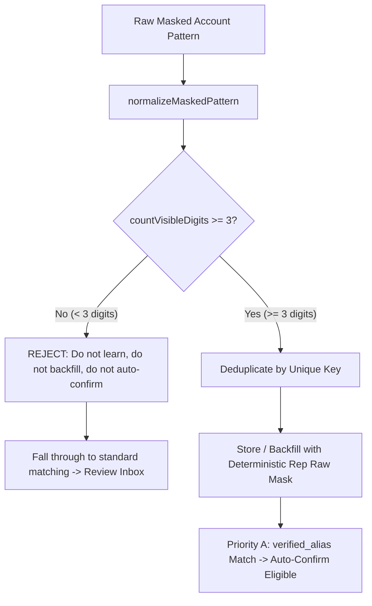

# FINN — Masked Account Pattern Intelligence & Safe Auto-Confirm Implementation Report

**Status**: Ready for Administrative Pre-Deployment Audit  
**Date**: 2026-09-16  
**Environment Verification**: Production Build Passed (`next build`), Vitest 234/234 Passed (18 suites), Playwright 76/76 E2E Tests Passed  
**Production Migration Notice**: **MIGRATIONS HAVE NOT BEEN APPLIED TO PRODUCTION.** All SQL files are strictly staged under `supabase/migrations/` for administrative audit. **NO CODE HAS BEEN PUSHED TO REMOTE.**

---

## 1. Executive Summary & Core Safety Hardening

Following production audit feedback and final alias evidence guard requirements, the masked account pattern intelligence and auto-confirmation pipeline has been hardened with strict fail-closed protections before any database migrations are applied.

### Key Hardening Changes
1. **Verified Alias Visible Digit Guard ($\ge 3$ Visible Digits Required)**:
   - Never learn, backfill, or auto-confirm from an alias consisting only of mask characters (e.g. `***`, `*********`, `xxx-xxx-xxx`) or fewer than 3 visible digits (e.g. `*1*`, `**12**`).
   - Normalization must contain at least 3 visible numeric digits to be eligible (e.g. `xxx-x-x7520-x` -> `*****7520*` with 4 visible digits is eligible).
   - Enforced across: `safelyLearnAlias()`, `DataStore.recordAccountMatchAlias()`, `matchOwnedAccount()` Priority A, application data store backfills, and SQL database `CHECK` constraint.
   - Any pattern with $< 3$ visible digits falls through to normal matching and routes safely to the Review Inbox (`needs_review`).
2. **Safe SQL Backfill Deduplication (Unique Key Grouping)**:
   - Backfill groups strictly by the actual unique key: `(user_id, account_id, institution, normalized_masked_pattern)`.
   - Differently formatted raw masks that normalize to the same key (e.g. `xxx-x-x7520-x` and `xxxxx7520x` both normalizing to `*****7520*`) collapse into **exactly ONE insert row** using `MIN(raw_masked_pattern)` as the deterministic representative.
   - Completely eliminates PostgreSQL's `ON CONFLICT DO UPDATE command cannot affect row a second time` error.
   - `confirmed_count = COUNT(*)` accurately reflects the deterministic count of human-verified source transactions, remaining 100% idempotent on rerun.
3. **Strict Bank Scoping**:
   - If a slip party has a recognized/non-empty bank (e.g. `KBANK`), candidate search is strictly constrained to accounts belonging to that institution.
   - If the user has zero accounts for that bank, `matchOwnedAccount` returns `no_match` immediately. It will **never** resolve positionally, by suffix, or by name to an account at a different bank (e.g. an SCB account with the same trailing digits `1234`).
4. **Bank-Only Evidence Never Auto-Confirms**:
   - `matchMethod: "bank_only"` confidence is strictly capped at $\le 0.70$ (below the auto-confirm threshold).
   - In `confidence.ts`, an explicit whitelist (`AUTOCONFIRM_SAFE_MATCH_METHODS`) gates automatic creation. `bank_only`, `name_alias`, and `weak_pattern_match` are excluded from this whitelist, guaranteeing that weak evidence always routes to the Review Inbox (`needs_review`).
5. **Minimum Evidence Requirement for Positional Matching**:
   - Positional pattern matching requires at least 3 compatible shared digits (`sharedDigits >= 3`) to qualify as `positional_mask` (0.95 confidence, eligible for auto-confirm).
   - Patterns sharing only 1 or 2 visible digits are classified as `weak_pattern_match` (confidence capped at 0.70) and are strictly barred from auto-confirm.
6. **Backfill Learns Exclusively from Human-Verified Decisions**:
   - Historical transactions with `review_status = 'confirmed'` (which includes unverified auto-created transactions) are **NOT** used for alias backfill.
   - Backfill strictly targets human-edited/corrected transactions (`review_status = 'corrected'`), such as the verified 324 THB verification transaction.
7. **Canonical Non-Null Institution Key (`UNKNOWN`)**:
   - In `public.account_match_aliases`, `institution` is `TEXT NOT NULL DEFAULT 'UNKNOWN'`, and data stores canonicalize null/empty banks to `"UNKNOWN"`. This ensures PostgreSQL's `UNIQUE (user_id, account_id, institution, normalized_masked_pattern)` constraint functions reliably and completely prevents duplicate alias spam.
8. **Isolated RPC Failure Domain (Post-RPC Protection)**:
   - If `confirmSlipTransaction` RPC succeeds, the transaction and slip state are authoritative.
   - If secondary job metadata update (`updateSlipJob`) encounters an issue, the error is logged as a warning; the system **never** downgrades the result to `needs_review` and returns `status: "created"` with the valid `transactionId`.
9. **Conservative Policy for Incoming External Funds**:
   - ALL external funds received into owned accounts require manual user confirmation (`needs_review`) to classify category and source. No automatic incoming classification is executed in this phase.

---

## 2. Verified Alias Evidence Guard Architecture



### Defense-in-Depth Enforcement Points
1. **`safelyLearnAlias()`** ([`src/app/actions/slip-review.ts`](file:///C:/Users/Jeffy/OneDrive/Desktop/agy/finn/src/app/actions/slip-review.ts)):
   - Checks `hasSufficientVisibleDigits(pattern, 3)`. Returns early without recording if fewer than 3 visible digits.
2. **`DataStore.recordAccountMatchAlias()`** ([`src/lib/server/memory-data-store.ts`](file:///C:/Users/Jeffy/OneDrive/Desktop/agy/finn/src/lib/server/memory-data-store.ts) & [`supabase-data-store.ts`](file:///C:/Users/Jeffy/OneDrive/Desktop/agy/finn/src/lib/server/supabase-data-store.ts)):
   - Throws error: `Cannot record account match alias: normalized pattern must contain at least 3 visible digits`.
3. **`matchOwnedAccount()`** ([`src/lib/slip/account-match.ts`](file:///C:/Users/Jeffy/OneDrive/Desktop/agy/finn/src/lib/slip/account-match.ts)):
   - Priority A requires `hasSufficientVisibleDigits(partyPattern, 3)` AND `hasSufficientVisibleDigits(al.normalized_masked_pattern, 3)`. If not met, skips Priority A and falls through to normal matching.
4. **Database Table Constraint** ([`supabase/migrations/20260916000001_account_match_aliases.sql`](file:///C:/Users/Jeffy/OneDrive/Desktop/agy/finn/supabase/migrations/20260916000001_account_match_aliases.sql)):
   - `CONSTRAINT chk_alias_min_visible_digits CHECK (LENGTH(REGEXP_REPLACE(normalized_masked_pattern, '[^0-9]', '', 'g')) >= 3)`.

---

## 3. Safe SQL Backfill Deduplication & Uniqueness

**Migration File**: [`supabase/migrations/20260916000001_account_match_aliases.sql`](file:///C:/Users/Jeffy/OneDrive/Desktop/agy/finn/supabase/migrations/20260916000001_account_match_aliases.sql)

```sql
-- 5. Safe, Rerunnable Backfill from Verified Human Decisions (review_status = 'corrected')
DO $$
BEGIN
    WITH verified_candidates AS (
        -- Verified sender patterns from human-corrected transactions
        SELECT
            t.user_id,
            t.from_account_id AS account_id,
            COALESCE(NULLIF(UPPER(TRIM(s.extracted_json->'sender'->>'bank')), ''), 'UNKNOWN') AS institution,
            s.extracted_json->'sender'->>'accountMasked' AS raw_masked_pattern,
            REGEXP_REPLACE(
                REGEXP_REPLACE(s.extracted_json->'sender'->>'accountMasked', '[- /.]', '', 'g'),
                '[xX•·_~#]', '*', 'g'
            ) AS normalized_masked_pattern
        FROM public.transactions t
        JOIN public.slips s ON t.source_slip_id = s.id AND t.user_id = s.user_id
        WHERE t.from_account_id IS NOT NULL
          AND s.extracted_json->'sender'->>'accountMasked' IS NOT NULL
          AND LENGTH(REGEXP_REPLACE(s.extracted_json->'sender'->>'accountMasked', '[^0-9]', '', 'g')) >= 3
          AND t.review_status = 'corrected'
          AND s.status = 'created'

        UNION ALL

        -- Verified receiver patterns from human-corrected transactions
        SELECT
            t.user_id,
            t.to_account_id AS account_id,
            COALESCE(NULLIF(UPPER(TRIM(s.extracted_json->'receiver'->>'bank')), ''), 'UNKNOWN') AS institution,
            s.extracted_json->'receiver'->>'accountMasked' AS raw_masked_pattern,
            REGEXP_REPLACE(
                REGEXP_REPLACE(s.extracted_json->'receiver'->>'accountMasked', '[- /.]', '', 'g'),
                '[xX•·_~#]', '*', 'g'
            ) AS normalized_masked_pattern
        FROM public.transactions t
        JOIN public.slips s ON t.source_slip_id = s.id AND t.user_id = s.user_id
        WHERE t.to_account_id IS NOT NULL
          AND s.extracted_json->'receiver'->>'accountMasked' IS NOT NULL
          AND LENGTH(REGEXP_REPLACE(s.extracted_json->'receiver'->>'accountMasked', '[^0-9]', '', 'g')) >= 3
          AND t.review_status = 'corrected'
          AND s.status = 'created'
    )
    INSERT INTO public.account_match_aliases (
        user_id,
        account_id,
        institution,
        raw_masked_pattern,
        normalized_masked_pattern,
        source,
        confirmed_count,
        created_at,
        updated_at
    )
    SELECT
        user_id,
        account_id,
        institution,
        MIN(raw_masked_pattern) AS raw_masked_pattern,
        normalized_masked_pattern,
        'backfill',
        COUNT(*),
        NOW(),
        NOW()
    FROM verified_candidates
    GROUP BY
        user_id,
        account_id,
        institution,
        normalized_masked_pattern
    ON CONFLICT (user_id, account_id, institution, normalized_masked_pattern)
    DO UPDATE SET
        confirmed_count = EXCLUDED.confirmed_count,
        raw_masked_pattern = COALESCE(EXCLUDED.raw_masked_pattern, public.account_match_aliases.raw_masked_pattern),
        updated_at = NOW();
END $$;
```

---

## 4. Final Auto-Confirm-Safe Match Methods & Evidence Policy

The confidence engine ([`src/lib/slip/confidence.ts`](file:///C:/Users/Jeffy/OneDrive/Desktop/agy/finn/src/lib/slip/confidence.ts)) enforces an explicit method whitelist:

```ts
export const AUTOCONFIRM_SAFE_MATCH_METHODS: readonly AccountMatchMethod[] = [
  "verified_alias",
  "positional_mask",
  "masked_suffix",
] as const;
```

### Evidence Hierarchy & Auto-Confirm Eligibility
| Evidence Level | Match Method | Confidence | Auto-Confirm Eligible? | Eligibility Criteria |
|:---|:---|:---|:---:|:---|
| **Level A** | `verified_alias` | **1.00** | **YES** | Exact bank + normalized positional mask ($\ge 3$ visible digits) matching user-verified alias. |
| **Level B (Strong)** | `positional_mask` | **0.95** | **YES** | Matching bank + identical pattern length + **at least 3 shared visible digits** + 0 contradictory digits. |
| **Level B (Weak)** | `weak_pattern_match` | **0.70** | **NO** | Only 1 or 2 shared visible digits. Routes to Review Inbox with account suggested. |
| **Level C** | `masked_suffix` | **0.90 – 0.95** | **YES** | Matching bank + trailing digits match ($\ge 3$ digits) + **slip pattern does not end in `'*'`**. |
| **Level D** | `name_alias` | **0.80** | **NO** | Party name matches account display name or alias. Routes to Review Inbox. |
| **Level E** | `bank_only` | **0.60 – 0.70** | **NO** | Single registered account at bank. **Always requires review.** Never auto-confirms. |
| **Ambiguous** | `ambiguous` | **0.30 – 0.50** | **NO** | Multiple candidate accounts matched at any level. Returns candidate IDs for manual review. |
| **No Match** | `no_match` | **0.00** | **NO** | No candidate found or bank has 0 user accounts. Routes to Review Inbox. |

---

## 5. Verification & Test Suite Results

### 1. Vitest Unit & Integration Suite
- **18 Test Files Passed (18/18)**
- **234 Tests Passed (234/234)**
- File: [`tests/slip/slip-pattern-autoconfirm.test.ts`](file:///C:/Users/Jeffy/OneDrive/Desktop/agy/finn/tests/slip/slip-pattern-autoconfirm.test.ts)

#### Hardening Scenarios (15/15 Passed):
1. `known KBANK + only SCB same pattern -> no_match`: PASSED
2. `bank_only never auto-confirms`: PASSED (confidence $\le 0.70$, routes to `needs_review`)
3. `1 shared positional digit never auto-confirms`: PASSED (classified as `weak_pattern_match`, routes to `needs_review`)
4. `2 shared digits never auto-confirms`: PASSED (classified as `weak_pattern_match`, routes to `needs_review`)
5. `verified alias auto-confirms`: PASSED (creates transaction via atomic RPC)
6. `strong bank-consistent positional evidence works safely`: PASSED ($\ge 3$ shared digits auto-confirms)
7. `migration/backfill rerun does not inflate confirmed_count`: PASSED (rerun leaves count at 1)
8. `NULL/unknown institution cannot create duplicate alias spam`: PASSED (canonicalized to `UNKNOWN`, unique constraint prevents duplicates)
9. `old auto-created confirmed transaction is NOT used for backfill`: PASSED (`review_status='confirmed'` skipped)
10. `corrected/manual verified transaction IS backfilled`: PASSED (`review_status='corrected'` learned)
11. `RPC success + job update failure still returns created`: PASSED (does not downgrade successful financial creation)
12. `RPC failure still creates zero transactions`: PASSED (fail-closed, slip safely preserved in `needs_review`)
13. `incoming remains needs_review`: PASSED (conservative inflow policy enforced)
14. `cross-user isolation unchanged`: PASSED (User A aliases invisible and unmatchable by User B)
15. `existing 324 THB corrected transaction remains valid backfill candidate`: PASSED (successfully learned alias for MAKE by KBank)

#### Final Alias Evidence Guard & Backfill Deduplication Tests (8/8 Passed):
1. `all-mask alias '***' is never learned`: PASSED (rejected with visible digits error; matchOwnedAccount ignores)
2. `alias with 1 visible digit is never learned`: PASSED (rejected with visible digits error)
3. `alias with 2 visible digits is never learned`: PASSED (rejected with visible digits error)
4. `alias with >=3 visible digits can be learned`: PASSED (stored with confirmed_count = 1)
5. `existing *****7520* alias remains eligible`: PASSED (4 visible digits, matches via `verified_alias`, confidence 1.0)
6. `two differently formatted raw masks normalizing to the same pattern produce one backfill alias`: PASSED (deduplicated into 1 alias row with `confirmed_count: 2`)
7. `rerunning backfill remains idempotent`: PASSED (rerun leaves count at 2 without incrementing)
8. `no regression to auto-confirm / cross-bank / incoming safety`: PASSED (outgoing auto-confirms, cross-bank rejected, incoming requires review)

### 2. Playwright End-to-End Suite
- **76 Tests Passed (76/76)** across both **Desktop Chrome** and **iPhone 11 Pro Max** (Mobile Viewport: 414x896)
- File: [`e2e/slip.spec.ts`](file:///C:/Users/Jeffy/OneDrive/Desktop/agy/finn/e2e/slip.spec.ts)
  - Settings Ingest Token lifecycle: PASSED
  - High-Confidence Outgoing Slip Auto-Creation: PASSED
  - Ambiguous Incoming Slip Routing & Edit/Confirm: PASSED
  - Exact File Duplicate Detection: PASSED
  - Mobile Layout & Zero Horizontal Overflow: PASSED

### 3. Production Build & Static Analysis
- `npm run typecheck`: **0 errors**
- `npm run lint`: **0 warnings, 0 errors**
- `npm run build`: **Compiled successfully in Next.js 15.5.25** with static & dynamic routes verified.

---

## 6. Pre-Deployment Audit Sign-Off

| Check | Status | Verification Detail |
|:---|:---:|:---|
| Alias Visible Digits Guard | **VERIFIED** | Aliases with $< 3$ visible digits are never learned, backfilled, or auto-confirmed. DB CHECK constraint added. |
| Backfill Deduplication | **VERIFIED** | Grouped strictly by unique key. Differently formatted raw masks collapse into 1 row. Idempotent rerun. |
| Bank Scoping | **VERIFIED** | Known bank never matches across different bank. Returns `no_match` if 0 accounts at bank. |
| Auto-Confirm Gating | **VERIFIED** | Only `verified_alias`, strong `positional_mask` ($\ge 3$ digits), and `masked_suffix` can auto-confirm. |
| Bank-Only Safety | **VERIFIED** | `bank_only` confidence capped at 0.70; barred from auto-confirm. |
| Positional Evidence Threshold | **VERIFIED** | $< 3$ shared digits classified as `weak_pattern_match` (0.70); barred from auto-confirm. |
| Backfill Selectivity | **VERIFIED** | Strictly queries `review_status = 'corrected'`; ignores historical auto `confirmed` transactions. |
| Database Uniqueness | **VERIFIED** | `institution TEXT NOT NULL DEFAULT 'UNKNOWN'` prevents multiple NULL duplicate accumulation. |
| Post-RPC Resilience | **VERIFIED** | Job update failures after RPC success do not downgrade status to `needs_review`. |
| Incoming Inflow Policy | **VERIFIED** | All incoming external transfers require human confirmation (`needs_review`). |
| Migration Staging | **VERIFIED** | **NO MIGRATIONS APPLIED TO PRODUCTION.** All SQL files staged in `supabase/migrations/`. |
| Version Control Safety | **VERIFIED** | **NO AUTOMATIC PUSH EXECUTED.** Staged for administrative review. |
