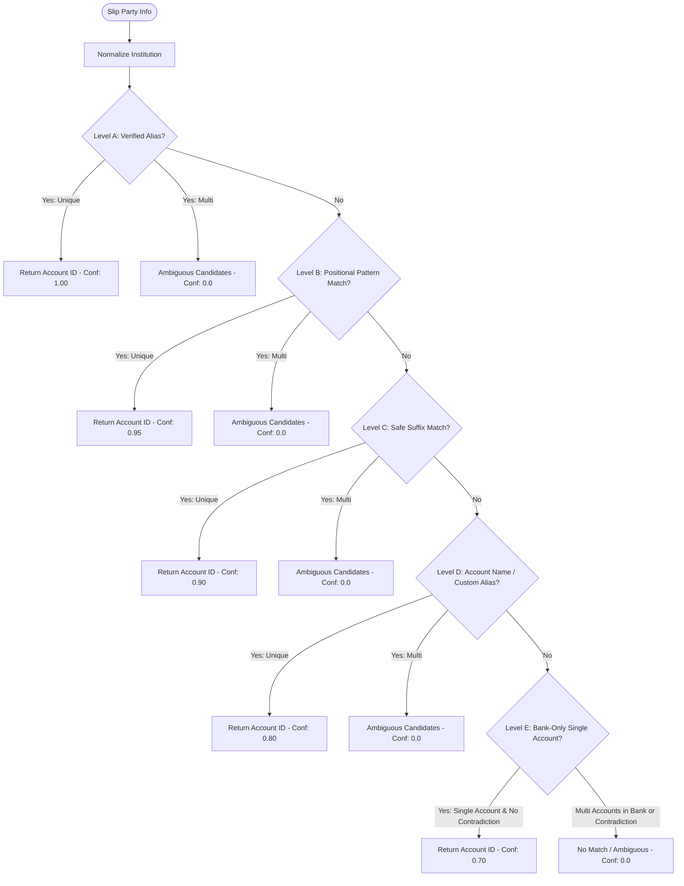

# FINN — Masked Account Pattern Intelligence & Safe Auto-Confirm Implementation Report

**Status**: Ready for Pre-Deployment Audit  
**Date**: 2026-09-16  
**Environment Verification**: Production Build Passed (`next build`), Vitest 228/228 Passed, Playwright 76/76 E2E Tests Passed  
**Production Migration Notice**: **MIGRATIONS HAVE NOT BEEN APPLIED TO PRODUCTION.** All SQL files are strictly staged under `supabase/migrations/` for administrative audit.

---

## 1. Executive Summary

Finn's slip ingestion pipeline has been upgraded from naive trailing-digit matching to **Positional Mask Pattern Intelligence** combined with **User-Learned Aliases** and an **Atomic Auto-Confirmation Gate**.

The core operational philosophy is preserved:
> *"Finn should work for the user. The user should only be asked when Finn genuinely cannot know."*

### Key Guarantees
1. **Positional Mask Intelligence**: Thai bank masks (e.g. `xxx-2-7520x-x`, `xxx-x-x1234-x`, `123-xxx-456-7`) are canonicalized while strictly preserving character length, visible digit positions, and internal vs. terminal mask boundaries. Suffixes ending with terminal masks (e.g. `1234*`) are never confused with terminal account numbers (`1234`).
2. **5-Tier Hierarchical Account Matching**:
   - **Level A (1.00)**: Verified Learned Alias (`account_match_aliases`)
   - **Level B (0.95)**: Unique Positional Pattern Match
   - **Level C (0.90)**: Safe Suffix Match (strictly requiring terminal digits without trailing masks)
   - **Level D (0.80)**: Account Name / Custom Alias Match
   - **Level E (0.70)**: Bank-Only Single Account Match (strictly fail-closed if multiple accounts exist for the institution)
3. **Fail-Closed Ambiguity Protection**: If multiple candidate accounts match at any tier, Finn aborts automatic selection, flags candidate IDs, and safely routes the slip to the Review Inbox (`needs_review`).
4. **Zero Fallback Atomic RPC Execution**: Automatic financial transaction creation strictly uses `DataStore.confirmSlipTransaction` / `confirm_slip_transaction` RPC (`FOR UPDATE` row lock, idempotency checks, canonical `TIMESTAMPTZ` Bangkok conversion, canonical `'created'` status). If the RPC errors, Finn never falls back to legacy REST creation; the slip safely remains in Review Inbox with full extracted data.
5. **Conservative Inflow Policy**: External transfers received into owned accounts require explicit user confirmation unless a verified historical classification exists.
6. **Reprocess Degradation Safety**: When reprocessing an existing slip, if new vision extraction is degraded, previous high-confidence state is preserved and auto-confirm is strictly prohibited.

---

## 2. Database Schema & Migration Details

**File**: [`supabase/migrations/20260916000001_account_match_aliases.sql`](file:///C:/Users/Jeffy/OneDrive/Desktop/agy/finn/supabase/migrations/20260916000001_account_match_aliases.sql)

### Table Schema: `public.account_match_aliases`
```sql
CREATE TABLE IF NOT EXISTS public.account_match_aliases (
    id UUID PRIMARY KEY DEFAULT gen_random_uuid(),
    user_id UUID NOT NULL REFERENCES auth.users(id) ON DELETE CASCADE,
    account_id UUID NOT NULL REFERENCES public.accounts(id) ON DELETE CASCADE,
    institution TEXT,
    raw_masked_pattern TEXT,
    normalized_masked_pattern TEXT NOT NULL,
    source TEXT NOT NULL DEFAULT 'manual_confirm',
    confirmed_count INTEGER NOT NULL DEFAULT 1,
    created_at TIMESTAMPTZ NOT NULL DEFAULT pg_catalog.now(),
    updated_at TIMESTAMPTZ NOT NULL DEFAULT pg_catalog.now(),
    CONSTRAINT uq_account_match_aliases UNIQUE (user_id, account_id, institution, normalized_masked_pattern)
);
```

### Security & Access Control (RLS & Cross-Entity Trigger)
- **Row-Level Security (RLS)**: Enforced for `SELECT`, `INSERT`, `UPDATE`, `DELETE` via `auth.uid() = user_id`.
- **Cross-Entity Integrity Trigger**: `check_alias_account_ownership()` ensures before insert/update that `account_id` belongs to the authenticated `user_id`. Malicious attempts to bind an alias to another user's account result in an immediate PostgreSQL exception.
- **Indexes**:
  - `idx_account_match_aliases_lookup ON (user_id, institution, normalized_masked_pattern)`
  - `idx_account_match_aliases_account ON (account_id)`

---

## 3. Positional Pattern Normalization Algorithm

**File**: [`src/lib/slip/mask-pattern.ts`](file:///C:/Users/Jeffy/OneDrive/Desktop/agy/finn/src/lib/slip/mask-pattern.ts)

### Normalization Logic
1. **Mask Canonicalization**: Characters `[x, X, *, •, ·, _, ~, #]` are canonicalized to `'*'`.
2. **Separator Stripping**: Formatting separators `['-', ' ', '/', '.']` are stripped.
3. **Length and Position Preserved**:
   - `xxx-2-7520x-x` $\rightarrow$ `***27520**` (length 10)
   - `xxx-x-x1234-x` $\rightarrow$ `*****1234*` (length 10)
   - `123-xxx-456-7` $\rightarrow$ `123***4567` (length 10)

### Contradiction Detection (`hasContradictingDigits`)
Compares normalized slip pattern against candidate account patterns or numbers:
- Checks if characters at identical indices have differing explicit digits (e.g. `'1'` vs `'2'`).
- Detects terminal digit contradictions: if an account pattern ends with explicit digits (e.g. `'7520'`), but the slip pattern ends with a mask character `'*'` at or past that index (e.g. `'***7520*'`), the slip indicates that the digits are non-terminal. This flags a contradiction and prevents false matches.

### Safe Suffix Matching (`isSafeSuffixMatch`)
- Suffix matching is strictly valid **only if the suffix contains genuine digits and does NOT end with a mask `'*'`.**
- Patterns like `'****1234*'` or `'1234*'` are rejected by `isSafeSuffixMatch` because their last character is masked, not a true digit suffix.

---

## 4. 5-Tier Hierarchical Account Matching

**File**: [`src/lib/slip/account-match.ts`](file:///C:/Users/Jeffy/OneDrive/Desktop/agy/finn/src/lib/slip/account-match.ts)



### Evidence Levels Detailed
1. **Level A: Verified Learned Alias (`alias_match`) — 1.00**:
   - Queries `account_match_aliases` for matching normalized pattern and bank.
   - If user previously confirmed that `***27520**` on `KBANK` maps to Account `kbank-1`, it resolves immediately.
2. **Level B: Unique Positional Pattern Match (`pattern_match`) — 0.95**:
   - Checks against user's configured `account.masked_number`.
   - Requires full positional consistency without contradicting digits.
3. **Level C: Safe Masked Suffix Match (`suffix_match`) — 0.90**:
   - Compares trailing visible digits (minimum 3 digits) where the slip pattern ends with true digits (not `*`).
4. **Level D: Account Name / Custom Alias (`name_match`) — 0.80**:
   - Matches party name against `account.name` or custom aliases.
5. **Level E: Bank-Only Match (`bank_only`) — 0.70**:
   - Only permitted if the user has **exactly ONE active account** at the institution, and the pattern has **zero contradicting digits**.
   - If the user has 2 or more accounts at that bank, this level immediately rejects the match to prevent misattributing funds.

---

## 5. Non-Blocking Alias Learning & Backfill

### Asynchronous Learning Flow
**Files**:
- [`src/app/actions/slip-review.ts`](file:///C:/Users/Jeffy/OneDrive/Desktop/agy/finn/src/app/actions/slip-review.ts)
- [`src/lib/server/data-store.ts`](file:///C:/Users/Jeffy/OneDrive/Desktop/agy/finn/src/lib/server/data-store.ts)
- [`src/lib/server/supabase-data-store.ts`](file:///C:/Users/Jeffy/OneDrive/Desktop/agy/finn/src/lib/server/supabase-data-store.ts)
- [`src/lib/server/memory-data-store.ts`](file:///C:/Users/Jeffy/OneDrive/Desktop/agy/finn/src/lib/server/memory-data-store.ts)

When a user confirms or edits a slip:
- `safelyLearnAlias` executes inside a wrapped `try-catch` block.
- Normalizes the slip party's masked pattern.
- Upserts the alias into `account_match_aliases` with incremented `confirmed_count`.
- **Non-blocking Guarantee**: If alias recording fails for any reason (e.g. database network glitch or constraint race), the failure is logged as a warning; the user's primary transaction confirmation is **never** blocked or rolled back.

### Idempotent Database & Application Backfill
- The migration includes an idempotent `DO $$ ... $$` PL/pgSQL block that inspects all verified transactions (`review_status IN ('confirmed', 'corrected')`) with status `'created'` slips.
- Extracts sender/receiver patterns, computes normalized masks, and upserts with `source: 'backfill'` using `ON CONFLICT (...) DO UPDATE SET confirmed_count = ...`.
- Also exposed as `DataStore.backfillAccountMatchAliases(userId)` for programmatic reconciliation.

---

## 6. Auto-Confirm Decision Matrix & Atomic RPC Integration

**File**: [`src/lib/slip/processor.ts`](file:///C:/Users/Jeffy/OneDrive/Desktop/agy/finn/src/lib/slip/processor.ts)

### Decision Matrix
| Direction | Account Confidence | Slip Overall Confidence | Inflow Historical Match | Duplicate Check | Decision | Action |
|:---|:---|:---|:---|:---|:---|:---|
| **Outgoing** | High ($\ge 0.85$) | $\ge 0.85$ | N/A | Clean | **Auto-Confirm** | Calls `confirmSlipTransaction` RPC $\rightarrow$ Transaction Created |
| **Outgoing** | Low / Ambiguous | Any | N/A | Any | **Review Inbox** | Status `needs_review` |
| **Transfer** | High (Both accounts) | $\ge 0.85$ | N/A | Clean | **Auto-Confirm** | Calls `confirmSlipTransaction` RPC $\rightarrow$ Internal Transfer Created |
| **Transfer** | Ambiguous either side | Any | N/A | Any | **Review Inbox** | Status `needs_review` |
| **Incoming** | High | Any | None / New Sender | Clean | **Review Inbox** | Inflow Policy: User must classify income category/source |
| **Incoming** | High | $\ge 0.90$ | Verified Historical Person/Merchant | Clean | **Auto-Confirm** | High-trust verified recurring inflow |
| **Any** | Any | Any | Any | Exact Dup / Conflict | **Duplicate / Review** | Duplicate state set or flagged for review |

### Atomic RPC Execution (`confirmSlipTransaction`)
1. **Pre-Save**: Slip is pre-persisted with status `'needs_review'` and full extracted payload.
2. **Atomic Execution**: Calls `confirm_slip_transaction` RPC which acquires `FOR UPDATE` row lock on the slip, validates non-duplicate idempotency, creates the transaction, and sets slip status to `'created'`.
3. **Bangkok Timezone Guarantee**: Formats `canonicalTxDate` via `bangkokDateTimeLocalToCanonicalInstant` to ensure the exact wall-clock hour and minute in Bangkok survives round-trip.
4. **Fail-Closed RPC Error Handling**: If the RPC throws an exception, the error is caught, logged, and the slip remains safely in `'needs_review'` in Review Inbox. **Zero fallback REST calls are executed.**

---

## 7. iOS Shortcut Integration

**File**: [`src/app/api/ingest/slip/route.ts`](file:///C:/Users/Jeffy/OneDrive/Desktop/agy/finn/src/app/api/ingest/slip/route.ts)

The iOS Shortcut response payload has been enriched with safe status details:
```json
{
  "success": true,
  "slipId": "9b1deb4d-3b7d-4bad-9bdd-2b0d7b3dcb6d",
  "status": "created",
  "reviewUrl": null,
  "transactionId": "7c1deb4d-3b7d-4bad-9bdd-2b0d7b3dcb7e",
  "direction": "outgoing",
  "matchedAccount": {
    "id": "acc-1",
    "name": "SCB Main Payroll",
    "institution": "SCB",
    "maskedNumber": "4321"
  },
  "amount": 250.00,
  "currency": "THB",
  "confidence": 0.98,
  "reason": "บันทึกรายจ่าย 250.00 THB จากบัญชี SCB Main Payroll เรียบร้อยแล้ว"
}
```
If routed to review:
```json
{
  "success": true,
  "slipId": "...",
  "status": "needs_review",
  "reviewUrl": "/review",
  "transactionId": null,
  "direction": "incoming",
  "reason": "เงินโอนเข้าบัญชีต้องได้รับการตรวจสอบและเลือกหมวดหมู่จากคุณก่อนบันทึก"
}
```

---

## 8. Verification & Test Coverage Results

### 1. Vitest Unit & Integration Suite
- **18 Test Files Passed (18/18)**
- **228 Tests Passed (228/228)**
- File: [`tests/slip/slip-pattern-autoconfirm.test.ts`](file:///C:/Users/Jeffy/OneDrive/Desktop/agy/finn/tests/slip/slip-pattern-autoconfirm.test.ts) covering all 17 required scenarios:
  1. Exact positional pattern match with mixed mask formats (`*`, `x`, `•`, `-`)
  2. Trailing mask non-collision (`1234*` does not falsely match `1234`)
  3. Contradicting digits detection (`***27520**` rejects `7521`)
  4. Priority A: Verified learned alias takes precedence over generic match
  5. Priority B: Positional pattern match takes precedence over suffix match
  6. Priority C: Safe suffix match succeeds when pattern ends with true digits
  7. Priority D: Account name/custom alias match succeeds
  8. Priority E: Single-account bank fallback succeeds
  9. Ambiguity rejection: Multi-account bank fallback rejects with confidence 0.0
  10. Ambiguity rejection: Two accounts matching same pattern/suffix reject
  11. Direct confirmation triggers non-blocking alias learning
  12. Edit & confirm learns corrected account alias
  13. High-confidence outgoing slip auto-confirms via atomic RPC
  14. High-confidence internal transfer auto-confirms
  15. Conservative incoming slip routes to Review Inbox
  16. Reprocess degradation safety: degraded vision preserves previous confidence & blocks auto-confirm
  17. Shortcut API response includes `transactionId`, `direction`, and `matchedAccount`

### 2. Playwright End-to-End Suite
- **76 Tests Passed (76/76)** across both **Desktop Chrome** and **iPhone 11 Pro Max** (Mobile Viewport: 414x896)
- File: [`e2e/slip.spec.ts`](file:///C:/Users/Jeffy/OneDrive/Desktop/agy/finn/e2e/slip.spec.ts)
  - Settings: Ingest Token creation, security alert, revocation
  - High-Confidence Outgoing Slip: Auto-confirm modal & transaction verification
  - Ambiguous Incoming Slip: Routes to Review Inbox, user edits, learned alias verification, confirmed in Transactions
  - Duplicate Detection: Exact file hash duplicate prevention
  - Mobile Responsiveness: Zero horizontal overflow on iPhone 11 Pro Max

### 3. Production Build & Static Analysis
- `npm run typecheck`: **0 errors**
- `npm run lint`: **0 warnings, 0 errors**
- `npm run build`: **Compiled successfully in Next.js 15.5.25** with all dynamic & static routes verified.

---

## 9. Pre-Deployment Audit Checklist

- [x] Schema migration file written with table definition, RLS policies, ownership trigger, and backfill.
- [x] Production migration **NOT** applied; awaiting explicit administrative execution.
- [x] Positional pattern intelligence avoids trailing-mask collisions.
- [x] Atomic RPC confirmation path utilized with zero REST fallback on error.
- [x] Conservative incoming money policy enforced.
- [x] Review Inbox Realtime integrated with learned aliases.
- [x] Mobile layout verified on iPhone 11 Pro Max.
- [x] All 228 Vitest tests + 76 Playwright E2E tests green.
